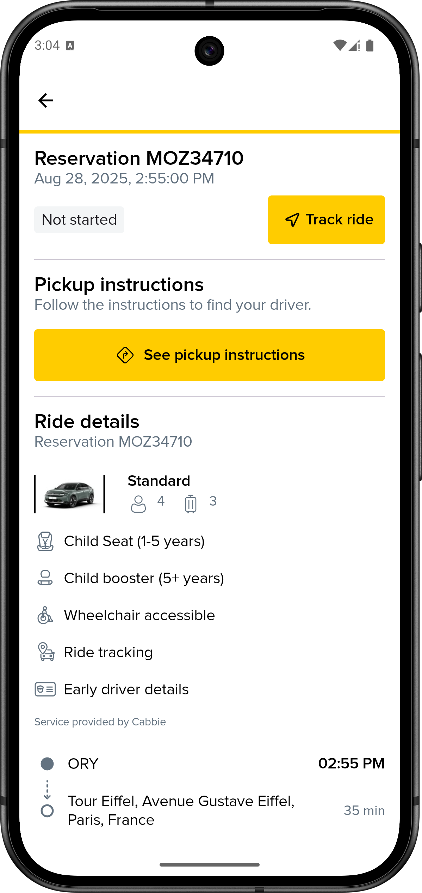
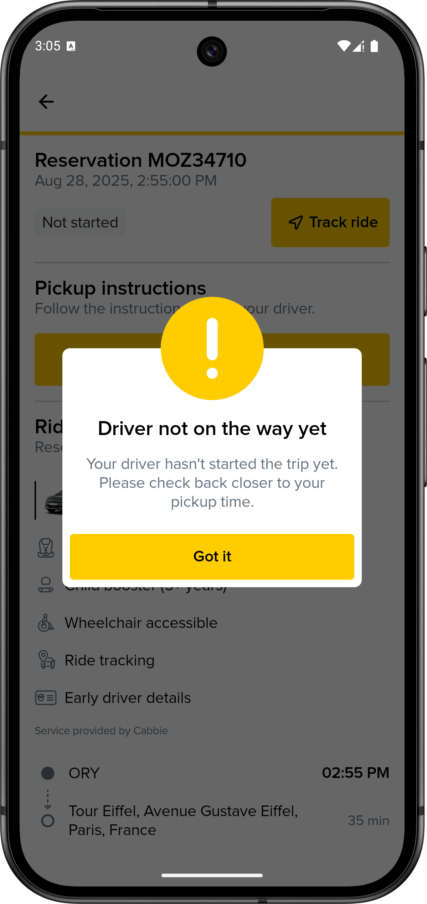
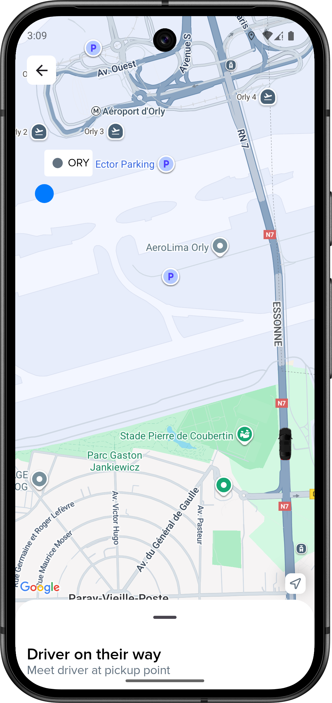
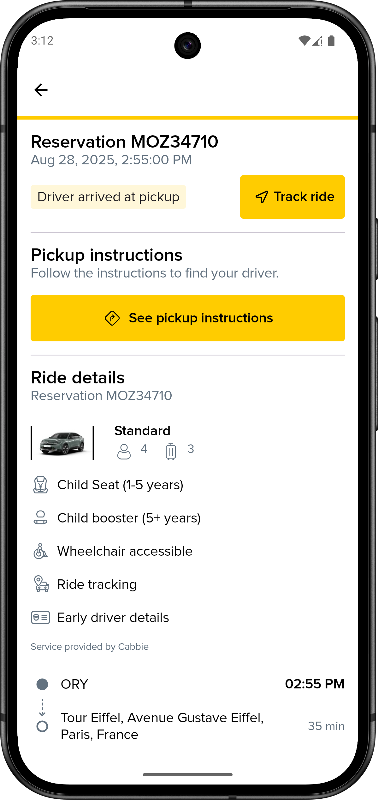
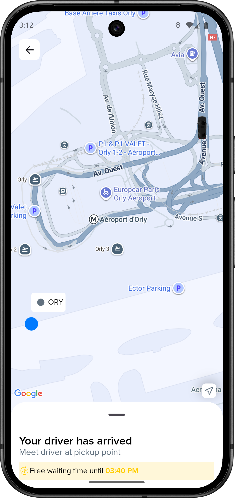
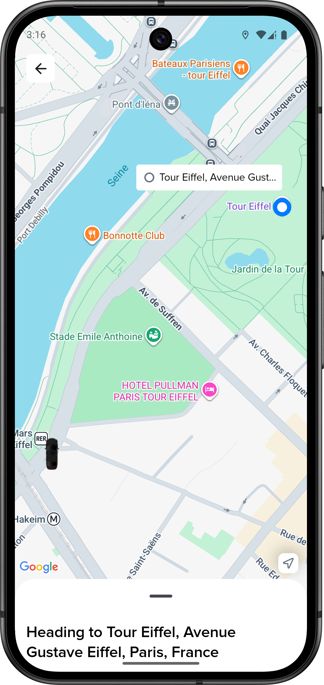
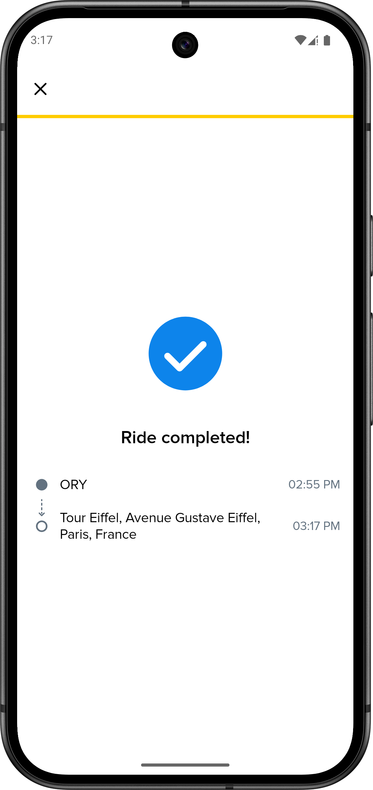

# Mozio Android SDK Integration Guide

Welcome to the **Mozio Android SDK**!
This repository includes a sample app to help you quickly integrate and test the SDK in your Android projects. Follow this guide to set up the SDK, customize it to your needs, and begin utilizing its powerful features.

---

## 📦 Setup the SDK

### 1. Add Maven Repositories
In your `settings.gradle.kts` file, include the Mozio and JitPack repositories:

```kotlin
maven("https://raw.githubusercontent.com/mozioinc/mobile-sdk-android/main/maven/") {
    content {
        includeGroupByRegex("com.mozio.mobile.*")
    }
}
maven("https://jitpack.io") {
    content {
        includeModule("com.github.jeziellago", "compose-markdown")
        includeModule("com.github.jeziellago", "Markwon")
    }
}
```

### 2. Add Dependencies
In your `libs.versions.toml`, specify the Mozio SDK version:

```toml
mozio-mobile-sdk = "0.1.0"
mozio-mobile-sdk-ui = { group = "com.mozio.mobile.android", name = "sdk-ui", version.ref = "mozio-mobile-sdk" }
```

Then, include the dependency in your app's `build.gradle.kts` file:

```kotlin
implementation(libs.mozio.mobile.sdk.ui)
```

### 3. Add Google Maps API Key

If your application doesn't use Google Maps already, include the following metadata in your `AndroidManifest.xml` file with your Google Maps API key:

```xml
<meta-data
android:name="com.google.android.geo.API_KEY"
android:value="YOUR_GOOGLE_MAPS_API_KEY" />
```

Replace `YOUR_GOOGLE_MAPS_API_KEY` with your actual Google Maps API key.

---

## 🛠 Initialize the SDK
In your `Application` class, inside the `onCreate()` method, initialize the Mozio SDK with the required parameters like:

```kotlin
MozioSDK.init(
    application = this,
    environment = Environment.TESTING,
    apiKey = ApiKey("YOUR_MOZIO_API_KEY")
)
```

Use `Environment.TESTING` or `Environment.PRODUCTION` based on your build variant configuration.
Replace `YOUR_MOZIO_API_KEY` with the appropriate apiKey provided by Mozio.

---

## 🚀 Using the SDK
To utilize the SDK's UI components, you can import them from `MozioSDK` using one of the provided composables:

```kotlin
MozioSDK.SearchRidesScreen() // This will open the Mozio search rides flow, providing users with a seamless booking experience.
MozioSDK.FindReservationBottomSheet() // This will open the Mozio find reservation flow, allowing users to find already booked reservations, see their statuses and live-track their driver.
```

---

## 🎨 Customizing the SDK

### SDK initialization

#### Overview
`MozioSDK.init()` is the method used to initialize the Mozio SDK. It sets up the required environment, API key, logging configurations, and other settings needed for operation.

#### Function Signature
```kotlin
fun init(
    application: Application,
    environment: Environment,
    apiKey: ApiKey,
    shouldDisplayResultsWhileLoading: Boolean = true,
    termsOfServiceUrl: TermsOfServiceUrl = TermsOfServiceUrl("https://www.mozio.com/en-us/terms-of-service"),
    logSeverity: LogSeverity = LogSeverity.DEBUG,
    ridesFilterAndSorter: RidesFilterAndSorter = provideRidesFilterAndSorter(),
    lightColors: ColorsConfig = defaultLightColorsConfig,
    darkColors: ColorsConfig = defaultDarkColorsConfig
)
```

#### Parameters
- **`application`** *(Application)*: The Android application instance.
- **`environment`** *(Environment)*: Defines whether to use the `TESTING` or `PRODUCTION` environment.
- **`apiKey`** *(ApiKey)*: The API key required to authenticate with the Mozio API.
- **`shouldDisplayResultsWhileLoading`** *(Boolean, optional)*: Determines whether ride results should start being displayed while search is still running. Defaults to `true`.
- **`termsOfServiceUrl`** *(TermsOfServiceUrl, optional)*: The URL linking to the terms of service. Defaults to Mozio's official terms.
- **`logSeverity`** *(LogSeverity, optional)*: Defines the severity level for logs. Defaults to `DEBUG`.
- **`ridesFilterAndSorter`** *(RidesFilterAndSorter, optional)*: A function that filters and sorts ride results before displaying them. Defaults to no sort/filter logic applied.
- **`lightColors`** *(ColorsConfig, optional)*: Defines the light theme colors for the SDK. Defaults to Mozio light colors.
- **`darkColors`** *(ColorsConfig, optional)*: Defines the dark theme colors for the SDK. Defaults to Mozio dark colors.

#### Environment Options
```kotlin
enum class Environment {
    TESTING, PRODUCTION
}
```

#### API Key
```kotlin
data class ApiKey(
    val apiKey: String
)
```

#### Log Severity Levels
```kotlin
enum class LogSeverity {
    VERBOSE,
    DEBUG,
    INFO,
    WARN,
    ERROR,
    ASSERT
}
```

#### Ride Filtering and Sorting
```kotlin
data class RidesFilterAndSorter(
    val filterAndSorter: (List<RideResult>) -> List<RideResult>
)
```

#### Theme Configuration
The `ColorsConfig` interface defines the color scheme used in the SDK:
```kotlin
interface ColorsConfig {
    val primary: Color // The primary color of the app, usually the one that identifies the brand. For main CTAs and notifications
    val secondary: Color // The secondary brand color or a contrasting color that matches the primary color. Used to mark selections, tool tips, helpers etc
    val foreground: Color // The foreground color mainly used for text
    val background: Color // The primary color used as a background color
    val route: Color // The color used to highlight the current route or waypoints on a map
    val information: Color // The primary color used when displaying informative elements
    val error: Color // The color used when displaying or highlighting error elements
    val success: Color // The color used when displaying or highlighting success elements
    val neutral1: Color // The neutral color used when highlighting light gray UI elements
    val neutral2: Color // The neutral color used when highlighting medium gray UI elements
    val neutral3: Color // The neutral color used when highlighting dark gray UI elements
}
```

#### Usage Examples

##### Basic Initialization
```kotlin
init(
    application = this,
    environment = Environment.PRODUCTION,
    apiKey = ApiKey("my-api-key")
)
```

##### Customizing Logging and Theme
```kotlin
init(
    application = this,
    environment = Environment.TESTING,
    apiKey = ApiKey("my-testing-api-key"),
    logSeverity = LogSeverity.VERBOSE,
    lightColors = customLightColors,
    darkColors = customDarkColors
)
```

##### Applying Custom Ride Filtering and Sorting
```kotlin
init(
    application = myApplication,
    environment = Environment.PRODUCTION,
    apiKey = ApiKey("my-api-key"),
    ridesFilterAndSorter = RidesFilterAndSorter { rides ->
        rides.sortedBy { it.price.totalCost.toDouble() }
    }
)
```

### SearchRidesScreen

#### Overview
`SearchRidesScreen` is a composable function designed to allow users to search and book a ride. Depending on the UI/UX requirements, it provides options for configuring a back icon and handling booking events.

#### Function Signature
```kotlin
@Composable
fun SearchRidesScreen(
    modifier: Modifier = Modifier,
    backIconConfiguration: BackIconConfiguration = BackIconConfiguration.NoIcon,
    onBookingEvent: (bookingEvent: BookingEvent) -> Unit = {}
)
```

#### Parameters
- **`modifier`** *(Modifier, optional)*: Used to apply layout and styling configurations.
- **`backIconConfiguration`** *(BackIconConfiguration, optional)*: Defines whether and how a back icon is displayed. Defaults to `BackIconConfiguration.NoIcon`.
- **`onBookingEvent`** *(Function, optional)*: A lambda function triggered during specific booking events. It takes a `BookingEvent` as input and provides a way to react to booking flow changes.

#### Back Icon Configuration
The `backIconConfiguration` parameter allows for different back icon behaviors using the `BackIconConfiguration` sealed interface:

```kotlin
sealed interface BackIconConfiguration {
    object NoIcon : BackIconConfiguration // No back icon is shown

    data class WithBackIcon(
        val onBackPress: () -> Unit // Displays a back arrow icon, triggers `onBackPress` when clicked
    ) : BackIconConfiguration

    data class WithCloseIcon(
        val onBackPress: () -> Unit // Displays an 'X' close icon, triggers `onBackPress` when clicked
    ) : BackIconConfiguration
}
```

#### Booking Events
The `onBookingEvent` callback allows handling booking-related events. It reacts to `BookingEvent`, which is a sealed interface representing different stages of the booking process:

```kotlin
sealed interface BookingEvent {
    object BookingComplete : BookingEvent // Triggered when the booking is completed
    object BookingConfirmationClosed : BookingEvent // Triggered when the user closes the booking confirmation screen shown after the booking is complete
}
```

#### Usage Examples
##### 1. Basic Usage Without Back Icon
```kotlin
SearchRidesScreen()
```

##### 2. Adding a Back Icon with Custom Behavior
```kotlin
SearchRidesScreen(
    backIconConfiguration = BackIconConfiguration.WithBackIcon(
        onBackPress = { /* Handle back press */ }
    )
)
```

##### 3. Handling Booking Events
```kotlin
SearchRidesScreen(
    onBookingEvent = { event ->
        when (event) {
            BookingEvent.BookingComplete -> println("Booking completed!")
            BookingEvent.BookingConfirmationClosed -> println("Booking confirmation closed")
        }
    }
)
```

Depending on your UI/UX, you might decide to show a back icon (or close icon) and close the booking flow when this icon is pressed, or you can use `onBookingEvent()` to react to `BookingEvent.BookingConfirmationClosed` and close the booking flow when the ride is booked and the user closes the booking confirmation screen.

---

### FindReservationBottomSheet

#### Overview
`FindReservationBottomSheet` is a composable function designed to allow users to see the details of an already booked reservation given its id and their last name. If the details match, the user is presented with the reservation details, where they can see everything about their reservation and also live-track their driver.

#### Function Signature
```kotlin
@Composable
fun FindReservationBottomSheet(
    onXClick: () -> Unit,
    modifier: Modifier = Modifier
)
```

#### Parameters
- **`onXClick`** *(Function)*: A lambda function triggered when the X button on the bottom sheet is tapped. Useful to react to the bottom sheet dismiss event.
- **`modifier`** *(Modifier, optional)*: Used to apply layout and styling configurations.

#### Usage Examples
##### Hide the bottom sheet when it's closed by the user
```kotlin
MozioSDK.FindReservationBottomSheet(
    onXClick = {
        showFindReservationBottomSheet = false
    }
)
```

---

## 🚗 How SDK Tracking Works with Mozio Driver App

The SDK tracking system provides a seamless real-time experience that synchronizes with the **[Mozio Driver app](https://play.google.com/store/apps/details?id=com.mozio.driver)**. Here's the detailed step-by-step workflow:

#### Step 1: Driver Assignment - Tracking Not Available Yet
- **Mozio Driver App:** 
    - Driver receives a new reservation assignment
- **SDK Behavior:**
    - Reservation status shows as `Not Started`
    - Users see reservation details (pickup time, assigned driver and vehicled details, pickup and destination location, etc)
    - Tracking button checks reservation status when tapped
        - If it's still `Not Started`, it shows an alert to the user
        - If it reaches a trackable state, it presents the full-screen tracking view with real-time updates

<p align="center">
  
  
</p>

#### Step 2: Driver Departs for Pickup - Tracking Begins
- **Mozio Driver App:** 
    - Driver swipes to indicate they are departing for pickup location
- **SDK Behavior:**
    - Reservation status updates to `Driver En Route`
    - **Tracking becomes available** 
    - When user taps "Track Ride", the full-screen tracking view opens
    - Tracking title shows `Driver on their way`
    - **Real-time driver location updates begin** on the map
        - ETA to pickup location is displayed and continuously updated
        - Driver information panel shows contact details and vehicle info
        - Status banner shows "Your driver is on the way to pick you up"

<p align="center">
  
  
</p>

#### Step 3: Driver Arrives at Pickup Point
- **Mozio Driver App:** 
    - Driver arrives at pickup location and updates status
- **SDK Behavior:**
    - Reservation status updates to `Driver Arrived`
    - Tracking title shows `Your driver has arrived`
    - **Driver location pin shows at pickup point** on the map
    - Status banner changes to "Your driver has arrived at the pickup location"
    - **Pickup instructions are prominently displayed** to guide passenger
    - Driver contact information remains accessible for coordination
    - **No-show handling:** If passenger doesn't appear, driver can mark as no-show, updating SDK status to `No Show`

<p align="center">
  
  
</p>

#### Step 4: En Route to Destination
- **Mozio Driver App:** 
    - Driver confirms passenger pickup and begins journey to destination
- **SDK Behavior:**
    - Reservation status updates to `In Progress`
    - Tracking title changes to `Heading to [destination]`
    - **ETA switches from pickup to destination** timing
    - Real-time route visualization shows on map with driver's current position
    - Status banner shows "You're on your way to [destination]"
    - **Continuous location and ETA updates** as driver progresses along route
    - Driver remains contactable throughout the journey

<p align="center">
  
  
</p>

#### Step 5: Ride Completed
- **Mozio Driver App:** 
    - Driver arrives at destination, drops off passenger and swipes to complete the ride
- **SDK Behavior:**
    - Reservation status updates to `Completed`
    - Tracking title shows ride completion status
    - **Animated celebration view appears** confirming successful ride completion
    - Final trip summary is displayed with completion time
    - Tracking automatically stops and view can be dismissed

<p align="center">
  
</p>

---

## 🛰️ How to simulate the ride live tracking
You can run a full end-to-end simulation to see how live tracking looks in the sdk and in your app.  

### 1. Book a Test Ride  

Use the following settings when booking:  

- **Pickup time:** within the next 3 hours.  
- **Routes (choose one):**  
  - *Short ride:* **44 Tehama Street, San Francisco, CA, USA** → **301 Van Ness Avenue, San Francisco, CA, USA**  
  - *Long ride:* **SFO: San Francisco, CA - San Francisco** → **44 Tehama Street, San Francisco, CA, USA**  
- **Provider:** select *Tracking Testing Provider*.  

### 2. Run the Simulation Script

From your terminal, run:  

```bash
./run_driver_live_tracking_simulation.sh CONFIRMATION_NUMBER LAST_NAME [SPEEDUP]
```

`CONFIRMATION_NUMBER` → the `MOZxxxxx` ID from your booking.  
`LAST_NAME` → passenger’s last name.  
`SPEEDUP` (optional) → multiplier for how fast the trip is simulated.  
Default: `1` (real-time). For longer rides, increase to `5`, `10`, etc.

When the script starts, it will also print a `simulation_id`. Keep this ID handy, it uniquely identifies your simulation in the logs if you need to contact us for any troubleshooting.

### 3. View the results
If everything runs correctly, the ride will begin broadcasting live tracking.

- Open the **Find Reservation** screen in the app using the *Confirmation Number* and *Passenger's Last Name*
- You should see a simulated car moving along the route 🚗💨 and ride status updates!

### 🛠️ Troubleshooting

If you don’t see the car moving on the map:
- ✅ Double-check your booking: ensure pickup time is within 3 hours and you chose *Tracking Testing Provider*. For the records, you could book also at another time, but live-tracking can be starte only when the current time is next to the pickup time.
- ✅ Confirm your inputs: `CONFIRMATION_NUMBER` must be the `MOZxxxxx` ID, and the passenger’s last name must match exactly.
- ✅ Adjust the speedup: for longer rides, use a higher `SPEEDUP` value so the car moves at a visible pace.
- ✅ Wait a moment: tracking updates are sent periodically; it may take a few seconds for the car to appear.

Still stuck? Reach out to the team with your `CONFIRMATION_NUMBER`, `LAST_NAME`, and `simulation_id` so we can help investigate.

---

## 🐞 Reporting Issues
If you encounter any issues or have questions, please open an issue in the [Mozio Android SDK repository](https://github.com/mozioinc/mobile-sdk-android).